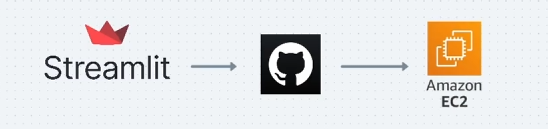
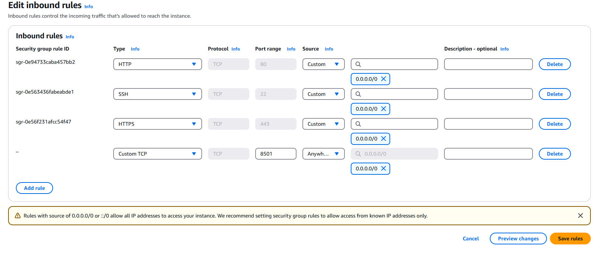

# Streamlit to S3 on EC2 Instance

**Presented by TRADE SQUARE CO.,LTD Thailand**

---
# Instruction
ref: https://www.youtube.com/watch?v=DflWqmppOAg&list=LL&ab_channel=DSwithBappy


## 0. Init Project

1. Create AWS Profile

    1.1 https://docs.aws.amazon.com/cli/latest/userguide/getting-started-install.html

    1.2 Generate Access key in IAM

    1.3 Open a terminal and run:
    ```bash  
    #1.3.1
    aws configure --profile vej #This will be use in PROFILE in the test script
    #1.3.2
    AWS Access Key ID [*************xxxx]: <Your AWS Access Key ID>
    #1.3.3
    AWS Secret Access Key [**************xxxx]: <Your AWS Secret Access Key>
    #1.3.4
    Default region name: [ap-southeast-1]: ap-southeast-1
    #1.3.5
    Default output format [None]: json

    ```
2. Open a terminal and run:
    ```bash
    #2.1
    pip3 install virtualenv
    virtualenv venv
    #2.2
   ./venv/Scripts/activate  #Windows PowerShell or cmd
   source ./venv/Scripts/activate  #Windows Terminal and Bash shell
    source venv/bin/activate #MAC or Linux and Bash shell
    #2.3
    pip install -r requirements.txt
    ```

3. If you computer does have a policy problem please refer to
    https://learn.microsoft.com/en-us/powershell/module/microsoft.powershell.security/set-executionpolicy?view=powershell-7.4#example-6-set-the-execution-policy-for-the-current-powershell-session

    ```bash
    """
    -Scope Process => Affects only the current PowerShell session
    """
    # all scripts are signed by a trusted publisher
    Set-ExecutionPolicy -ExecutionPolicy AllSigned -Scope Process
    # Nothing is blocked and there are no warnings or prompts.
    Set-ExecutionPolicy -ExecutionPolicy Bypass -Scope Process
    ```
    
---

### 1. SET UP EC2!



    1. At least t2.small
    2. EC2 -> Instance -> Security -> Security Group
    3. Edit inbound rules -> Mapping new port as 8501 or the same port number within .streamlit/config.toml

    4. Connect to EC2 instance


```bash
    ## run the below command one by one
    sudo apt update
    sudo apt-get update
    sudo apt upgrade -y
    sudo apt install git curl unzip tar make sudo vim wget -y

    sudo apt install python3-pip
    sudo apt install python3.12-venvY

    #install awscli
    curl "https://awscli.amazonaws.com/awscli-exe-linux-x86_64.zip" -o "awscliv2.zip"
    unzip awscliv2.zip
    sudo ./aws/install
    

    # Option 1: if clone avaliable 
    git clone https://github.com/tradesquare/streamlit-to-s3.git ## Or Upload Zip from S3 or other ways around

    # Option 2: Upload .zip -> copy from s3 to EC2
    # You also need to set aws configure --profile one more time in this EC2 Instance
    aws s3 cp s3://from-streamlit-bucket/streamlit-to-s3.zip streamlit-to-s3.zip --profile tsmlxl 

    # for Option 2, don't forget to unzip
    upzip streamlit-to-s3.zip
    
    cd streamlit-to-s3-main
    python3 -m venv venv

    # Re-open venv everytime you quit EC2 Instance
    source venv/bin/activate

    pip install -r requirements.txt

    #Temporary running streamlit
    python3 -m streamlit run streamlit_app.py

    #Permanent running
    nohup python3 -m streamlit run streamlit_app.py

    #kill no up = ctrl+C or
    ps aux | grep streamlit
    kill -9 <PID>

```
### 


---
## To visualize result on local
1. Open a terminal and run:

    ```bash

    streamlit run streamlit_app.py

    ```
2. If you want to deactivate Streamlit App 

    - use *Ctrl+C*

    - or close *VS Code*

3. You cann now view your Streamlit app in your browser

    ```bash
    Local URL: http://localhost:8501
    Network URL: http://192.168.1.43:8501
    ```
4. Port could be changed in .streamlit -> config.tonl -> port  [default is 8501, could change to 8502,8503,etc]
